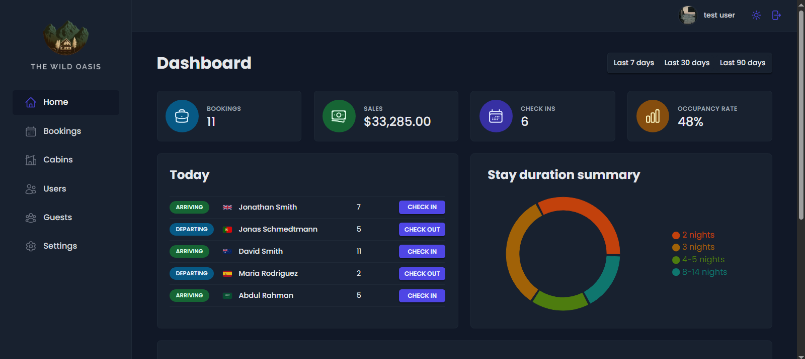
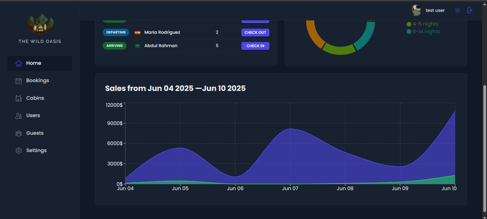

# 🌴 The Wild Oasis – Hotel Management System

The Wild Oasis is a fully responsive hotel management web application built with React.js and modern web technologies. It is designed specifically for hotel staff, enabling authorized users to manage bookings, guests, cabins, users, and more through a secure, interactive dashboard.

## 🚀 Live Demo

vercel: https://the-wild-oasis-seven-lilac.vercel.app/
netlify: https://the-wild-oasis-hager.netlify.app/login

---

## 🛠️ Tech Stack

- **Frontend**: React.js, Vite, React Router DOM (SPA)
- **Styling**: Styled Components
- **State Management**:
  - Remote Global State: React Query
  - Local UI State: React Context API
- **Forms**: React Hook Form
- **Backend**: Supabase (Authentication, Database, API)
- **Charts & UI Tools**: Recharts, React Hot Toast, React Icons, Date-fns

---

## 🔐 Authentication & Authorization

- Only **authorized users** can access the dashboard.
- User login is done via **email and password** through Supabase.
- Only **already logged-in users** can create new user accounts.

---

## 📱 Features Overview

### ✅ Dashboard (Home Page)
- View today's activity (check-ins/outs).
- Visualize data via two charts:
  - **Sales Summary**
  - **Stays Duration Summary**
- Key performance metrics for:
  - Bookings
  - Sales
  - Occupancy
  - Check-ins — over the last **7, 30, or 90 days**

### 📅 Bookings
- View all bookings
- Filter bookings based on multiple criteria
- Add a new booking
- View, check-in, check-out, delete, or inspect booking details

### 🛏️ Cabins
- Add, edit, or delete cabin listings
- Filter available cabins

### 👥 Guests
- Add new guest entries

### 🧑‍💼 Users
- Create new user accounts (only by logged-in users)

### ⚙️ Settings
- Control hotel settings:
  - Breakfast price
  - Maximum nights per booking
  - Other adjustable preferences

### 🙍‍♂️ Account
- Update personal information:
  - Profile image
  - Username
  - Password

---

## 🎨 UI & UX Highlights

- Fully **responsive design** for all screen sizes
- **Dark/Light Mode** toggle for better accessibility
- Clean, intuitive, and modern UI with smooth interactions

---

## 📸 Screenshots

-- **Dashboard (Home Page)**:  
  
   
  
